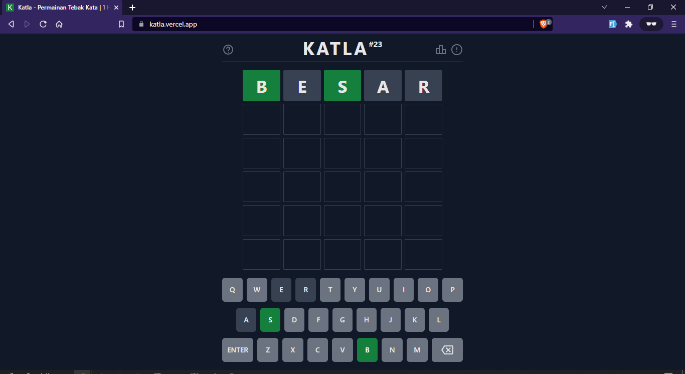

# Petunjuk Katla

Membantu memecahkan kuis [Katla](https://katla.vercel.app/) lebih mudah.

Coba disini: [petunjuk-katla.vercel.app](https://petunjuk-katla.vercel.app/)

&nbsp;

## Petunjuk Penggunaan

Pertama, mulai permainan [Katla](https://katla.vercel.app/) dan tebak kata pertama kamu. contoh *BESAR*:



kamu akan mendapatkan petunjuk katla, ketik *POWER* di [petunjuk katla](https://petunjuk-katla.vercel.app/) seperti yang kamu masukkan di katla lalu **klik masing-masing huruf** untuk mengubah warna sesuai respon di katla :

- klik 1 kali: abu-abu (tidak ada)
- dua kali: kuning (benar namun letaknya salah)
- tiga kali: hijau (benar dan letaknya sesuai)

Setelah itu klik **enter** dan kata-kata yang terkait dengan petunjuk yang kamu masukkan akan muncul di sebelah kanan:


pilih salah satu dan masukkan di katla:


Jika belum sesuai, kembali masukkan di petunjuk katla:


Selamat, kamu menang:


&nbsp;

## Disclaimer

- Petunjuk katla adalah hasil modifikasi dari [wordle helper](https://github.com/Renovamen/wordle-helper.git)
- Database KBBI berasal dari [andrisetiawan/lexicon](https://github.com/andrisetiawan/lexicon/blob/master/kata_dasar_kbbi.csv)

## Development

It's powered by [Vue 3](https://v3.vuejs.org/), [Tailwind CSS](https://tailwindcss.com) and [Vite](https://vitejs.dev/).

Clone the repo and install dependencies:

```bash
yarn
```

Start dev server / building:

```bash
yarn dev
yarn build
```


&nbsp;

## License

[MIT](LICENSE)
